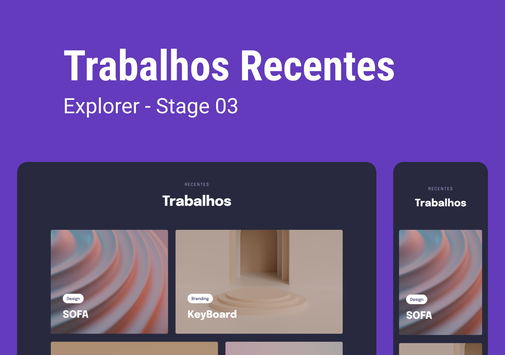

<h1 align="center">Trabalhos Recentes</h1>

  Projeto retirado do programa Explorer, um programa de estudo exclusivo promovido pela Rocketseat para o ensino de tecnologias web.

  <a href="#-layout">Layout</a>&nbsp;&nbsp;&nbsp;|&nbsp;&nbsp;&nbsp;
  <a href="#-aprendizado">Aprendizado</a>&nbsp;&nbsp;&nbsp;|&nbsp;&nbsp;&nbsp;
  <a href="#-projeto">Projeto</a>&nbsp;&nbsp;&nbsp;|&nbsp;&nbsp;&nbsp;
  <a href="#-tecnologias">Tecnologias</a>&nbsp;&nbsp;&nbsp;|&nbsp;&nbsp;&nbsp;
  <a href="#-licença">Licença</a>

 

  

 

  

## 🎨 Layout

Você pode visualizar o layout do projeto através [DESSE LINK](https://www.figma.com/file/sKWePDyLi3TtGphphy6tYk/Explorer-Stage-03-Projeto-03/duplicate).

## 📖 Aprendizado

- Aprendi e aprimorei meus conhecimentos em animações utilizando o Tailwind CSS;
- Desenvolvi habilidades avançadas no uso do grid layout com o Tailwind CSS;
- Explorei a aplicação de filtros em imagens por meio do Tailwind CSS;
- Aprofundei minha compreensão e prática em mobile first, garantindo uma melhor experiência em dispositivos móveis.

## 💻 Projeto

Nesse projeto, meu objetivo principal foi criar um layout responsivo, utilizando os conceitos de mobile first, grid layout, animações e filtros. Para implementar esse projeto, escolhi utilizar o Tailwind CSS, uma ferramenta poderosa que me permitiu desenvolver de forma eficiente e produtiva.

## 🧪 Tecnologias

Esse projeto foi desenvolvido com as seguintes tecnologias:

- [HTML](https://developer.mozilla.org/pt-BR/docs/Web/HTML)
- [TailwindCSS](https://tailwindcss.com)
- [JavaScript](https://developer.mozilla.org/pt-BR/docs/Web/JavaScript)
- [NPM](https://www.npmjs.com)
- [Git](https://git-scm.com)
- [Figma](https://www.figma.com)
- [ICONS8](https://icons8.com)

## 📝 Licença

Este projeto está sob a licença MIT. Consulte o arquivo [LICENSE](https://github.com/kauankarvalho/Trabalhos-Recentes/blob/main/LICENSE) para obter mais detalhes.
